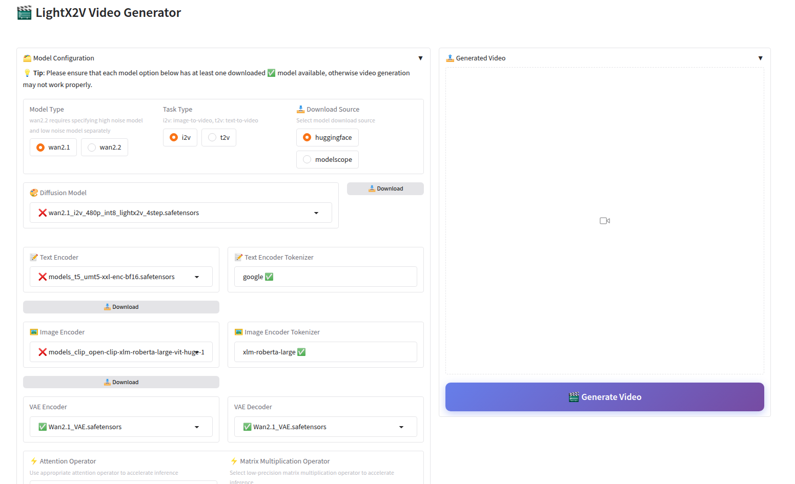

# Windows Local Deployment Guide

## 📖 Overview

This document provides detailed instructions for deploying LightX2V locally on Windows environments, including batch file inference, Gradio Web interface inference, and other usage methods.

## 🚀 Quick Start

### Environment Requirements

#### Hardware Requirements
- **GPU**: NVIDIA GPU, recommended 8GB+ VRAM
- **Memory**: Recommended 16GB+ RAM
- **Storage**: Strongly recommended to use SSD solid-state drives, mechanical hard drives will cause slow model loading


## 🎯 Usage Methods

### Method 1: Using Batch File Inference

Refer to [Quick Start Guide](../getting_started/quickstart.md) to install environment, and use [batch files](https://github.com/ModelTC/LightX2V/tree/main/scripts/win) to run.

### Method 2: Using Gradio Web Interface Inference

#### Manual Gradio Configuration

Refer to [Quick Start Guide](../getting_started/quickstart.md) to install environment, refer to [Gradio Deployment Guide](./deploy_gradio.md)

#### One-Click Gradio Startup (Recommended)

**📦 Download Software Package**
- [Quark Cloud](https://pan.quark.cn/s/f44023dcf8c8)

**📁 Directory Structure**
After extraction, ensure the directory structure is as follows:

```
├── env/                        # LightX2V environment directory
├── LightX2V/                   # LightX2V project directory
├── start_lightx2v.bat          # One-click startup script
├── lightx2v_config.txt         # Configuration file
├── LightX2V使用说明.txt         # LightX2V usage instructions
├── outputs/                    # Generated video save directory
└── models/                     # Model storage directory
```

**⚠️ Note for RTX 50 Series GPU Users**: We provide a dedicated runtime environment. Please download from [Quark Cloud](https://pan.quark.cn/s/4028867091b8), extract and replace the `env/` directory in the software package.

**📥 Model Download**:

You can directly download from the Gradio frontend, with two download sources provided: HuggingFace and ModelScope. You can choose according to your situation, or refer to the [Model Structure Documentation](../getting_started/model_structure.md) to manually download.


**📋 Configuration Parameters**

Edit the `lightx2v_config.txt` file and modify the following parameters as needed:

```ini

# Interface language (zh: Chinese, en: English)
lang=en

# Server port
port=8032

# GPU device ID (0, 1, 2...)
gpu=0

# Model path
model_path=models/
```

**🚀 Start Service**

Double-click to run the `start_lightx2v.bat` file, the script will:
1. Automatically read configuration file
2. Verify model paths and file integrity
3. Start Gradio Web interface
4. Automatically open browser to access service




**⚠️ Important Notes**:
- **Display Issues**: If the webpage opens blank or displays abnormally, please run `pip install --upgrade gradio` to upgrade the Gradio version.

### Method 3: Using ComfyUI Inference

This guide will instruct you on how to download and use the portable version of the Lightx2v-ComfyUI environment, so you can avoid manual environment configuration steps. This is suitable for users who want to quickly start experiencing accelerated video generation with Lightx2v on Windows systems.

#### Download the Windows Portable Environment:

- [Baidu Cloud Download](https://pan.baidu.com/s/1SB6JYySKog-tfO_IZDPvtQ?pwd=yxht)

The portable environment already packages all Python runtime dependencies, including the code and dependencies for ComfyUI and LightX2V. After downloading, simply extract to use.

After extraction, the directory structure is as follows:

```shell
lightx2v_env
├──📂 ComfyUI                    # ComfyUI code
├──📂 portable_python312_embed   # Standalone Python environment
└── run_nvidia_gpu.bat            # Windows startup script (double-click to start)
```

#### Start ComfyUI

Directly double-click the run_nvidia_gpu.bat file. The system will open a Command Prompt window and run the program. The first startup may take a while, please be patient. After startup is complete, the browser will automatically open and display the ComfyUI frontend interface.


The plugin used by LightX2V-ComfyUI is [ComfyUI-Lightx2vWrapper](https://github.com/ModelTC/ComfyUI-Lightx2vWrapper). Example workflows can be obtained from this project.

#### Tested Graphics Cards (offload mode)

- Tested model: `Wan2.1-I2V-14B-480P`

| GPU Model   | Task Type   | VRAM Capacity | Actual Max VRAM Usage | Actual Max RAM Usage |
|:-----------|:------------|:--------------|:---------------------|:---------------------|
| 3090Ti     | I2V         | 24G           | 6.1G                 | 7.1G                 |
| 3080Ti     | I2V         | 12G           | 6.1G                 | 7.1G                 |
| 3060Ti     | I2V         | 8G            | 6.1G                 | 7.1G                 |
| 4070Ti Super    | I2V        | 16G         | 6.1G        | 7.1G          |
| 4070    | I2V        | 12G         | 6.1G        | 7.1G          |
| 4060    | I2V        | 8G         | 6.1G        | 7.1G          |

#### Environment Packaging and Usage Reference
- [ComfyUI](https://github.com/comfyanonymous/ComfyUI)
- [Portable-Windows-ComfyUI-Docs](https://docs.comfy.org/zh-CN/installation/comfyui_portable_windows#portable-%E5%8F%8A%E8%87%AA%E9%83%A8%E7%BD%B2)
