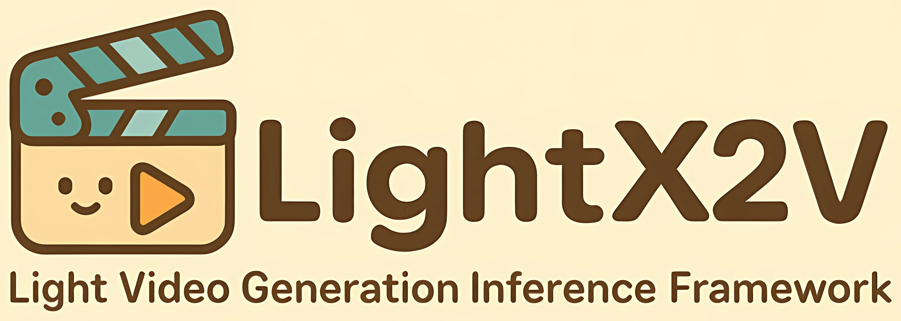

Welcome to Lightx2v!
==================

.. raw:: html

    

    
    
    
    
    

    

    

    <strong>LightX2V: Light Video Generation Inference Framework</strong>
    

LightX2V is a lightweight video generation inference framework designed to provide an inference tool that leverages multiple advanced video generation inference techniques. As a unified inference platform, this framework supports various generation tasks such as text-to-video (T2V) and image-to-video (I2V) across different models. X2V means transforming different input modalities (such as text or images) to video output.

GitHub: https://github.com/ModelTC/lightx2v

HuggingFace: https://huggingface.co/lightx2v

Documentation
-------------

.. toctree::
   :maxdepth: 1
   :caption: Quick Start

   Quick Start <getting_started/quickstart.md>
   Model Structure <getting_started/model_structure.md>
   Benchmark <getting_started/benchmark.md>

.. toctree::
   :maxdepth: 1
   :caption: Method Tutorials

   Model Quantization <method_tutorials/quantization.md>
   Feature Caching <method_tutorials/cache.md>
   Attention Module <method_tutorials/attention.md>
   Offload <method_tutorials/offload.md>
   Parallel Inference <method_tutorials/parallel.md>
   Changing Resolution Inference <method_tutorials/changing_resolution.md>
   Step Distill <method_tutorials/step_distill.md>
   Autoregressive Distill <method_tutorials/autoregressive_distill.md>
   Video Frame Interpolation <method_tutorials/video_frame_interpolation.md>

.. toctree::
   :maxdepth: 1
   :caption: Deployment Guides

   Low Latency Deployment <deploy_guides/for_low_latency.md>
   Low Resource Deployment <deploy_guides/for_low_resource.md>
   Lora Deployment <deploy_guides/lora_deploy.md>
   Service Deployment <deploy_guides/deploy_service.md>
   Gradio Deployment <deploy_guides/deploy_gradio.md>
   ComfyUI Deployment <deploy_guides/deploy_comfyui.md>
   Local Windows Deployment <deploy_guides/deploy_local_windows.md>
