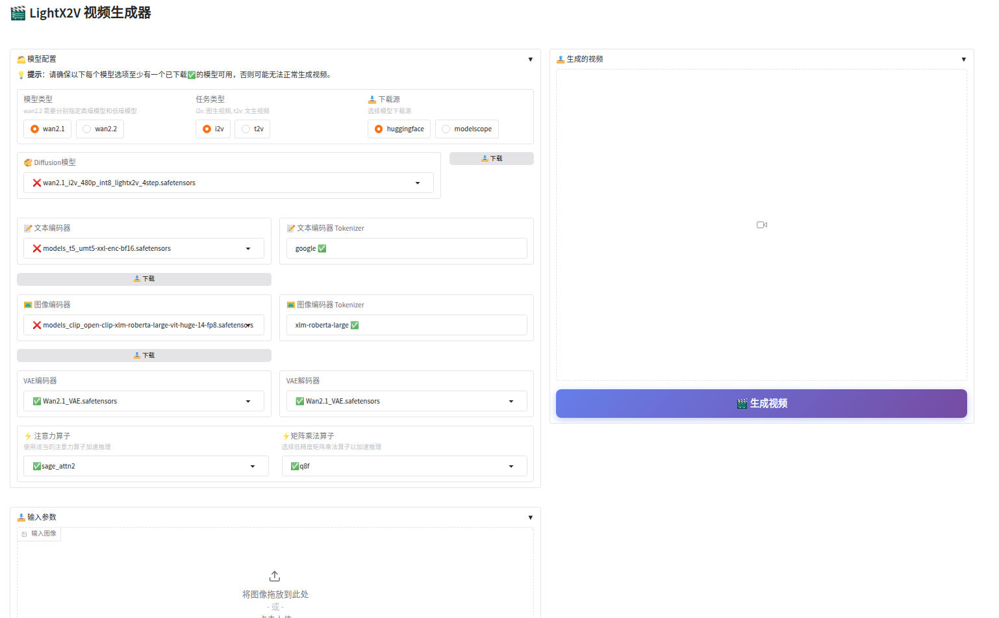

# Windows 本地部署指南

## 📖 概述

本文档将详细指导您在Windows环境下完成LightX2V的本地部署配置，包括批处理文件推理、Gradio Web界面推理等多种使用方式。

## 🚀 快速开始

### 环境要求

#### 硬件要求
- **GPU**: NVIDIA GPU，建议 8GB+ VRAM
- **内存**: 建议 16GB+ RAM
- **存储**: 强烈建议使用 SSD 固态硬盘，机械硬盘会导致模型加载缓慢

## 🎯 使用方式

### 方式一：使用批处理文件推理

参考[快速开始文档](../getting_started/quickstart.md)安装环境，并使用[批处理文件](https://github.com/ModelTC/LightX2V/tree/main/scripts/win)运行。

### 方式二：使用Gradio Web界面推理

#### 手动配置Gradio

参考[快速开始文档](../getting_started/quickstart.md)安装环境，参考[Gradio部署指南](./deploy_gradio.md)

#### 一键启动Gradio（推荐）

**📦 下载软件包**
- [夸克网盘](https://pan.quark.cn/s/f44023dcf8c8)


**📁 目录结构**
解压后，确保目录结构如下：

```
├── env/                        # LightX2V 环境目录
├── LightX2V/                   # LightX2V 项目目录
├── start_lightx2v.bat          # 一键启动脚本
├── lightx2v_config.txt         # 配置文件
├── LightX2V使用说明.txt         # LightX2V使用说明
├── outputs/                    # 生成的视频保存目录
└── models/                     # 模型存放目录
```

**RTX 50系显卡用户注意**：我们提供了专用的运行环境。请从[夸克网盘](https://pan.quark.cn/s/4028867091b8)下载，解压后替换软件包中的 `env/` 目录即可。

**📥 下载模型**:

可直接从gradio前端下载，提供了两个下载源，huggingface和modelscope，可根据自己情况选择，或参考[模型结构文档](../getting_started/model_structure.md)手动下载


**📋 配置参数**

编辑 `lightx2v_config.txt` 文件，根据需要修改以下参数：

```ini

# 界面语言 (zh: 中文, en: 英文)
lang=zh

# 服务器端口
port=8032

# GPU设备ID (0, 1, 2...)
gpu=0

# 模型路径
model_path=models/
```

**🚀 启动服务**

双击运行 `start_lightx2v.bat` 文件，脚本将：
1. 自动读取配置文件
2. 验证模型路径和文件完整性
3. 启动 Gradio Web 界面
4. 自动打开浏览器访问服务




**⚠️ 重要提示**:
- **页面显示问题**: 如果网页打开空白或显示异常，请运行 `pip install --upgrade gradio` 升级Gradio版本。


### 方式三：使用ComfyUI推理

此说明将指导您如何下载与使用便携版的Lightx2v-ComfyUI环境，如此可以免去手动配置环境的步骤，适用于想要在Windows系统下快速开始体验使用Lightx2v加速视频生成的用户。

#### 下载Windows便携环境：

- [百度网盘下载](https://pan.baidu.com/s/1SB6JYySKog-tfO_IZDPvtQ?pwd=yxht)

便携环境中已经打包了所有Python运行相关的依赖，也包括ComfyUI和LightX2V的代码及其相关依赖，下载后解压即可使用。

解压后对应的文件目录说明如下：

```shell
lightx2v_env
├──📂 ComfyUI                    # ComfyUI代码
├──📂 portable_python312_embed   # 独立的Python环境
└── run_nvidia_gpu.bat            # Windows启动脚本（双击启动）
```

#### 启动ComfyUI

直接双击run_nvidia_gpu.bat文件，系统会打开一个Command Prompt窗口并运行程序，一般第一次启动时间会比较久，请耐心等待，启动完成后会自动打开浏览器并出现ComfyUI的前端界面。


LightX2V-ComfyUI的插件使用的是，[ComfyUI-Lightx2vWrapper](https://github.com/ModelTC/ComfyUI-Lightx2vWrapper)，示例工作流可以从此项目中获取。

#### 已测试显卡（offload模式）

- 测试模型`Wan2.1-I2V-14B-480P`

| 显卡型号   | 任务类型     | 显存容量    | 实际最大显存占用 | 实际最大内存占用 |
|:----------|:-----------|:-----------|:--------    |:----------    |
| 3090Ti    | I2V        | 24G        | 6.1G        | 7.1G          |
| 3080Ti    | I2V        | 12G        | 6.1G        | 7.1G          |
| 3060Ti    | I2V        | 8G         | 6.1G        | 7.1G          |
| 4070Ti Super    | I2V        | 16G         | 6.1G        | 7.1G          |
| 4070    | I2V        | 12G         | 6.1G        | 7.1G          |
| 4060    | I2V        | 8G         | 6.1G        | 7.1G          |


#### 环境打包和使用参考
- [ComfyUI](https://github.com/comfyanonymous/ComfyUI)
- [Portable-Windows-ComfyUI-Docs](https://docs.comfy.org/zh-CN/installation/comfyui_portable_windows#portable-%E5%8F%8A%E8%87%AA%E9%83%A8%E7%BD%B2)
