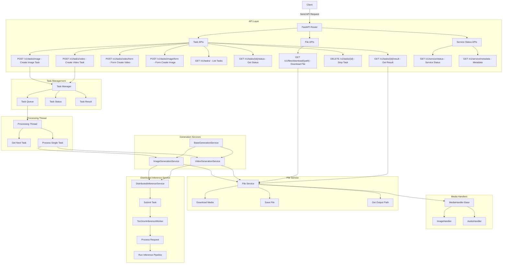
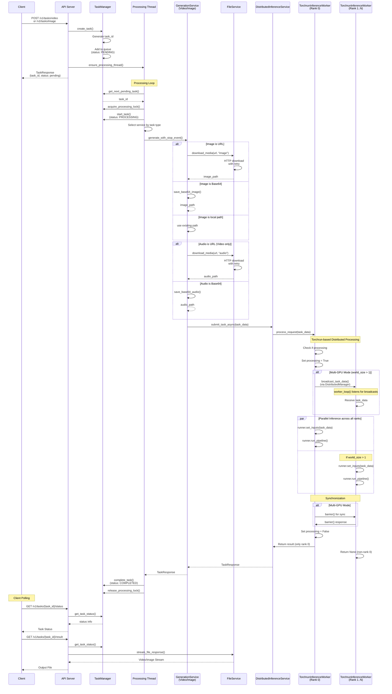
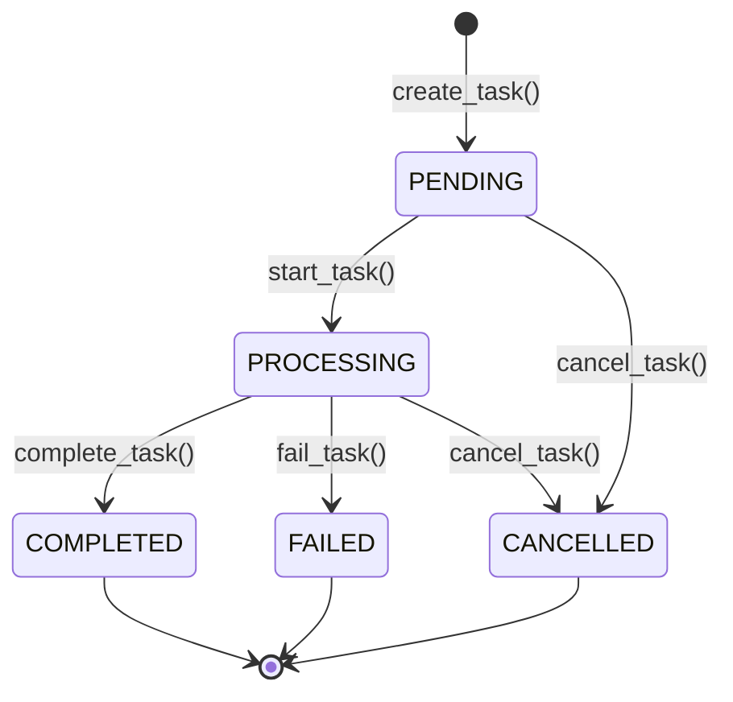

# LightX2V Server

## Overview

The LightX2V server is a distributed video/image generation service built with FastAPI that processes image-to-video and text-to-image tasks using a multi-process architecture with GPU support. It implements a sophisticated task queue system with distributed inference capabilities for high-throughput generation workloads.

## Directory Structure

```
server/
├── __init__.py
├── __main__.py              # Entry point
├── main.py                  # Server startup
├── config.py                # Configuration
├── task_manager.py          # Task management
├── schema.py                # Data models (VideoTaskRequest, ImageTaskRequest)
├── api/
│   ├── __init__.py
│   ├── router.py            # Main router aggregation
│   ├── deps.py              # Dependency injection container
│   ├── server.py            # ApiServer class
│   ├── files.py             # /v1/files/*
│   ├── service_routes.py    # /v1/service/*
│   └── tasks/
│       ├── __init__.py
│       ├── common.py        # Common task operations
│       ├── video.py         # POST /v1/tasks/video
│       └── image.py         # POST /v1/tasks/image
├── services/
│   ├── __init__.py
│   ├── file_service.py      # File service (unified download)
│   ├── distributed_utils.py # Distributed manager
│   ├── inference/
│   │   ├── __init__.py
│   │   ├── worker.py        # TorchrunInferenceWorker
│   │   └── service.py       # DistributedInferenceService
│   └── generation/
│       ├── __init__.py
│       ├── base.py          # Base generation service
│       ├── video.py         # VideoGenerationService
│       └── image.py         # ImageGenerationService
├── media/
│   ├── __init__.py
│   ├── base.py              # MediaHandler base class
│   ├── image.py             # ImageHandler
│   └── audio.py             # AudioHandler
└── metrics/                 # Prometheus metrics
```

## Architecture

### System Architecture



## Task Processing Flow



## Task States



## API Endpoints

### Task APIs

| Endpoint | Method | Description |
|----------|--------|-------------|
| `/v1/tasks/video` | POST | Create video generation task |
| `/v1/tasks/video/form` | POST | Create video task with form data |
| `/v1/tasks/image` | POST | Create image generation task |
| `/v1/tasks/image/form` | POST | Create image task with form data |
| `/v1/tasks` | GET | List all tasks |
| `/v1/tasks/queue/status` | GET | Get queue status |
| `/v1/tasks/{task_id}/status` | GET | Get task status |
| `/v1/tasks/{task_id}/result` | GET | Get task result (stream) |
| `/v1/tasks/{task_id}` | DELETE | Cancel task |
| `/v1/tasks/all/running` | DELETE | Cancel all running tasks |

### File APIs

| Endpoint | Method | Description |
|----------|--------|-------------|
| `/v1/files/download/{path}` | GET | Download output file |

### Service APIs

| Endpoint | Method | Description |
|----------|--------|-------------|
| `/v1/service/status` | GET | Get service status |
| `/v1/service/metadata` | GET | Get service metadata |

## Request Models

### VideoTaskRequest

```python
class VideoTaskRequest(BaseTaskRequest):
    num_fragments: int = 1
    target_video_length: int = 81
    audio_path: str = ""
    video_duration: int = 5
    talk_objects: Optional[list[TalkObject]] = None
```

### ImageTaskRequest

```python
class ImageTaskRequest(BaseTaskRequest):
    aspect_ratio: str = "16:9"
```

### BaseTaskRequest (Common Fields)

```python
class BaseTaskRequest(BaseModel):
    task_id: str  # auto-generated
    prompt: str = ""
    use_prompt_enhancer: bool = False
    negative_prompt: str = ""
    image_path: str = ""  # URL, base64, or local path
    save_result_path: str = ""
    infer_steps: int = 5
    seed: int  # auto-generated
```

## Configuration

### Environment Variables

see `lightx2v/server/config.py`

### Command Line Arguments

```bash
# Single GPU
python -m lightx2v.server \
    --model_path /path/to/model \
    --model_cls wan2.1_distill \
    --task i2v \
    --host 0.0.0.0 \
    --port 8000 \
    --config_json /path/to/xxx_config.json
```

```bash
# Multi-GPU with torchrun
torchrun --nproc_per_node=2 -m lightx2v.server \
    --model_path /path/to/model \
    --model_cls wan2.1_distill \
    --task i2v \
    --host 0.0.0.0 \
    --port 8000 \
    --config_json /path/to/xxx_dist_config.json
```

## Key Features

### 1. Distributed Processing

- **Multi-process architecture** for GPU parallelization
- **Master-worker pattern** with rank 0 as coordinator
- **PyTorch distributed** backend (NCCL for GPU, Gloo for CPU)
- **Automatic GPU allocation** across processes
- **Task broadcasting** with chunked pickle serialization

### 2. Task Queue Management

- **Thread-safe** task queue with locks
- **Sequential processing** with single processing thread
- **Configurable queue limits** with overflow protection
- **Task prioritization** (FIFO)
- **Automatic cleanup** of old completed tasks
- **Cancellation support** for pending and running tasks

### 3. File Management

- **Multiple input formats**: URL, base64, file upload
- **HTTP downloads** with exponential backoff retry
- **Streaming responses** for large video files
- **Cache management** with automatic cleanup
- **File validation** and format detection
- **Unified media handling** via MediaHandler pattern

### 4. Separate Video/Image Endpoints

- **Dedicated endpoints** for video and image generation
- **Type-specific request models** (VideoTaskRequest, ImageTaskRequest)
- **Automatic service routing** based on task type
- **Backward compatible** with legacy `/v1/tasks` endpoint

## Performance Considerations

1. **Single Task Processing**: Tasks are processed sequentially to manage GPU memory effectively
2. **Multi-GPU Support**: Distributes inference across available GPUs for parallelization
3. **Connection Pooling**: Reuses HTTP connections to reduce overhead
4. **Streaming Responses**: Large files are streamed to avoid memory issues
5. **Queue Management**: Automatic task cleanup prevents memory leaks
6. **Process Isolation**: Distributed workers run in separate processes for stability

## Monitoring and Debugging

### Logging

The server uses `loguru` for structured logging. Logs include:

- Request/response details
- Task lifecycle events
- Worker process status
- Error traces with context

### Health Checks

- `/v1/service/status` - Overall service health
- `/v1/tasks/queue/status` - Queue status and processing state
- Process monitoring via system tools (htop, nvidia-smi)

### Common Issues

1. **GPU Out of Memory**: Reduce `nproc_per_node` or adjust model batch size
2. **Task Timeout**: Increase `LIGHTX2V_TASK_TIMEOUT` for longer videos
3. **Queue Full**: Increase `LIGHTX2V_MAX_QUEUE_SIZE` or add rate limiting

## Security Considerations

1. **Input Validation**: All inputs validated with Pydantic schemas

## License

See the main project LICENSE file for licensing information.
